# Diagram & Alur Aplikasi SPKT Digital

Dokumen ini menjelaskan **seluruh alur** aplikasi SPKT Digital: siapa mengakses apa, bagaimana data mengalir dari UI → API → database, dan status tiap layanan.

---

## 1. Ringkasan Sistem

SPKT Digital adalah sistem pelayanan kepolisian online berbasis **Next.js 15** + **SQLite** (`data/spkt.db`).

| Komponen | Lokasi |
|----------|--------|
| Frontend (React) | `src/components/`, `src/app/page.tsx` |
| API REST | `src/app/api/**` |
| Business logic | `src/lib/services/` |
| Database & migrasi | `src/lib/db.ts` |
| File upload | `data/uploads/` |

Tiga layanan utama:

1. **Laporan** — masyarakat melaporkan kejadian (LP/xxx)
2. **Surat** — pengajuan SKCK, kehilangan, dokumen rusak, izin keramaian (SKCK/SKH/SKR/IZIN)
3. **Pengaduan** — keluhan terhadap pelayanan SPKT (ADU/xxx)

---

## 2. Arsitektur Layer

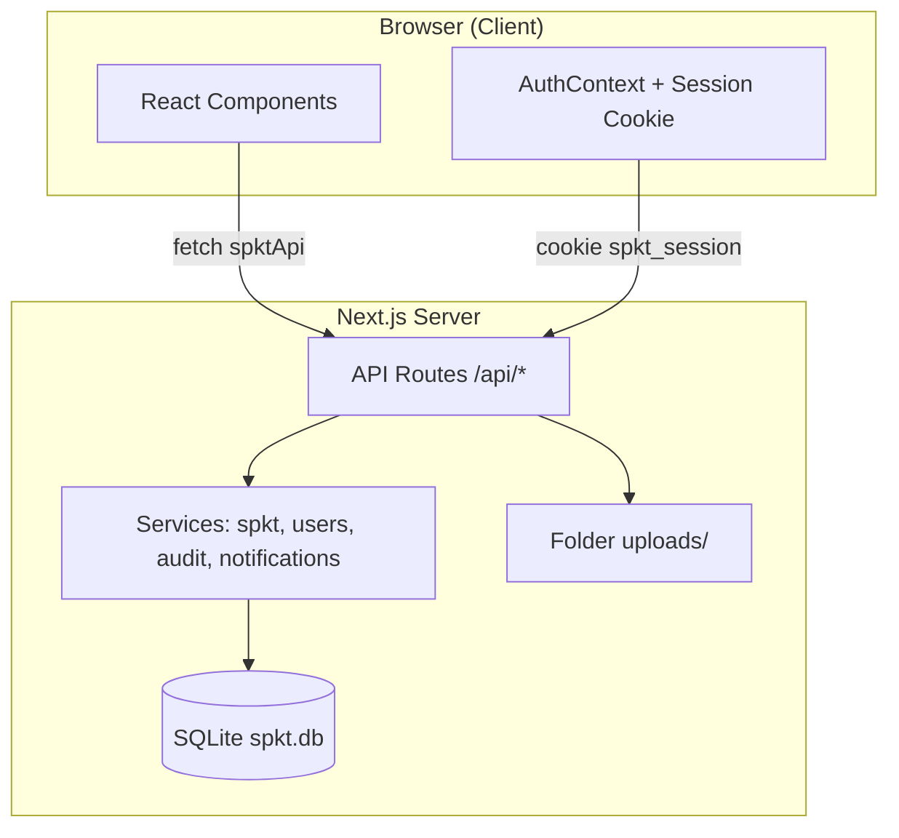

---

## 3. Aktor & Peran

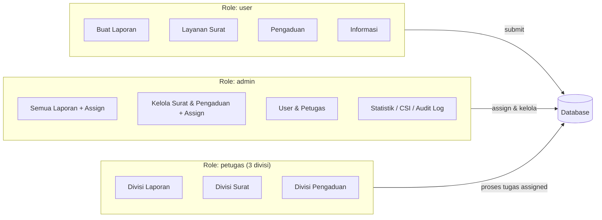

### Akun demo

| Role | Email | Password |
|------|-------|----------|
| Masyarakat | `user@spkt.id` | `spkt123` |
| Petugas Laporan | `petugas@spkt.id` | `spkt123` |
| Petugas Surat | `petugas-surat@spkt.id` | `spkt123` |
| Petugas Pengaduan | `petugas-pengaduan@spkt.id` | `spkt123` |
| Admin | `admin@spkt.id` | `spkt123` |

---

## 4. Alur Autentikasi

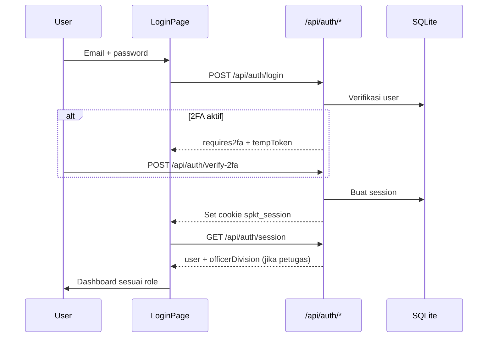

| Endpoint | Fungsi |
|----------|--------|
| `POST /api/auth/register` | Daftar masyarakat (NIK wajib) |
| `POST /api/auth/login` | Login |
| `POST /api/auth/logout` | Logout |
| `GET /api/auth/session` | Cek sesi aktif |
| `POST /api/auth/forgot-password` | Reset password (demo) |

**Catatan:** Petugas punya field `officerDivision` di sesi (`laporan` | `surat` | `pengaduan`) yang menentukan menu sidebar.

---

## 5. Navigasi & Menu per Role

Routing memakai query `/?view=<nama-view>` (lihat `DashboardApp.tsx`).

### Masyarakat (`user`)

| Menu | View | Fungsi |
|------|------|--------|
| Dashboard | `dashboard` | Ringkasan aktivitas |
| Buat Laporan | `create-report` | Form laporan baru / draft |
| Laporan Saya | `my-reports` | Daftar & hapus laporan sendiri |
| Layanan Surat | `letter-service` | Ajukan surat |
| Pengaduan | `complaints` | Buat & lihat pengaduan |
| Informasi | `information` | Artikel panduan |
| Pengaturan | `settings` | Profil & keamanan |

### Admin (`admin`)

| Menu | View | Fungsi |
|------|------|--------|
| Dashboard | `dashboard` | Statistik ringkas |
| Semua Laporan | `all-reports` | Assign, override, detail |
| Layanan Surat | `letter-service` | Assign & kelola semua surat |
| Pengaduan | `complaints` | Assign & kelola semua pengaduan |
| User Management | `user-management` | CRUD user |
| Kelola Petugas | `officer-management` | CRUD petugas + divisi |
| Audit Log | `audit-log` | Riwayat aksi admin |
| Statistik | `statistics` | Grafik layanan |
| Kepuasan (CSI) | `csi-dashboard` | Survey kepuasan |
| Informasi | `information` | Baca artikel |
| Kelola Artikel | `article-management` | CRUD artikel |
| Pengaturan | `settings` | Profil admin |

### Petugas (`petugas`) — per divisi

| Divisi | Menu | View |
|--------|------|------|
| **Laporan** | Dashboard, Laporan Masuk, Pengaturan | `dashboard`, `incoming-reports`, `settings` |
| **Surat** | Dashboard, Layanan Surat, Pengaturan | `dashboard`, `letter-service`, `settings` |
| **Pengaduan** | Dashboard, Pengaduan, Pengaturan | `dashboard`, `complaints`, `settings` |

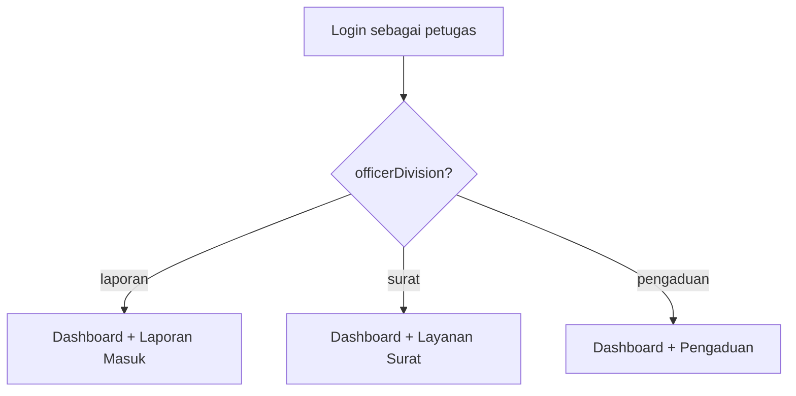

---

## 6. Alur Laporan (Reports)

### 6.1 Diagram alur bisnis

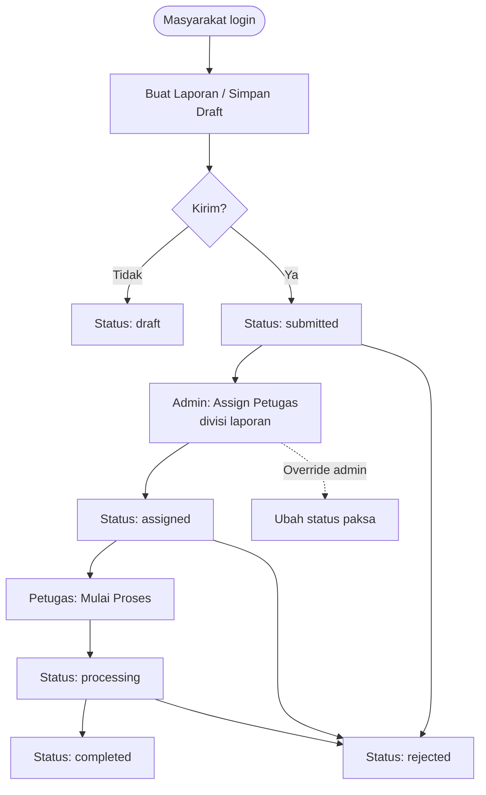

### 6.2 Transisi status laporan

```
draft → submitted
submitted → verified | assigned | rejected
verified → assigned | rejected
assigned → processing | rejected
processing → completed | rejected
```

### 6.3 Nomor referensi

Format: `LP/001/V/2026` (prefix LP, counter per tahun)

### 6.4 API

| Method | Endpoint | Siapa |
|--------|----------|-------|
| GET | `/api/reports` | User (NIK sendiri), Petugas (assigned), Admin (semua) |
| POST | `/api/reports` | User (buat laporan) |
| GET/PATCH/DELETE | `/api/reports/[id]` | User (milik sendiri), Petugas (assigned), Admin |

### 6.5 Aturan penting

- **Admin** yang assign petugas (petugas **tidak** berebut antrian).
- Petugas assign hanya dari divisi **laporan**.
- Petugas hanya bisa update laporan yang **sudah ditugaskan** ke dirinya.
- User bisa hapus laporan status `draft` atau `submitted`.

---

## 7. Alur Layanan Surat (Letters)

### 7.1 Jenis surat

| ID | Jenis | Prefix nomor |
|----|-------|--------------|
| `skck` | SKCK | SKCK |
| `kehilangan` | Surat Keterangan Kehilangan | SKH |
| `kerusakan` | Surat Keterangan Dokumen Rusak | SKR |
| `keramaian` | Izin Keramaian | IZIN |

### 7.2 Diagram alur

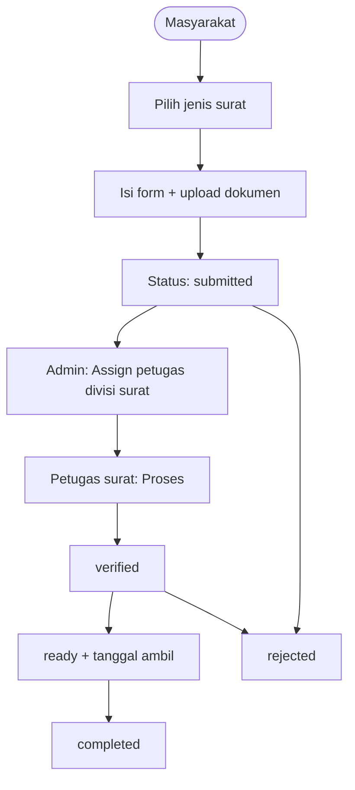

### 7.3 Transisi status surat

```
draft → submitted
submitted → verified | rejected
verified → ready | rejected
ready → completed
```

### 7.4 API

| Method | Endpoint | Siapa |
|--------|----------|-------|
| GET | `/api/letters` | User (NIK), Petugas (assigned), Admin (semua) |
| POST | `/api/letters` | User |
| PATCH | `/api/letters/[id]` | User (draft), Petugas (assigned), Admin (assign) |
| GET | `/api/letters/[id]/pdf` | Unduh PDF surat |

---

## 8. Alur Pengaduan (Complaints)

### 8.1 Kategori

`pelayanan` · `petugas` · `fasilitas` · `sistem` · `lainnya`

### 8.2 Diagram alur

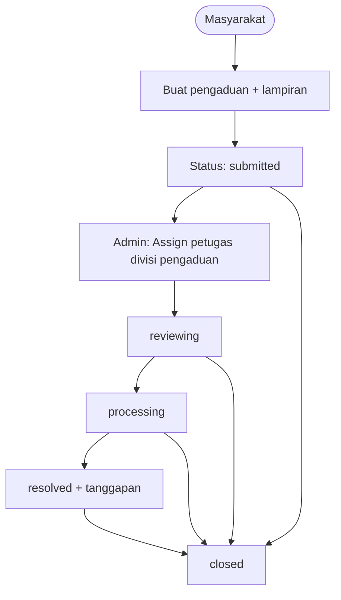

### 8.3 Transisi status pengaduan

```
submitted → reviewing | closed
reviewing → processing | closed
processing → resolved | closed
resolved → closed
```

### 8.4 API

| Method | Endpoint | Siapa |
|--------|----------|-------|
| GET | `/api/complaints` | User (NIK), Petugas (assigned), Admin (semua) |
| POST | `/api/complaints` | User |
| PATCH | `/api/complaints/[id]` | Petugas (assigned), Admin (assign + tanggapan) |

---

## 9. Alur Admin (Assign & Kelola)

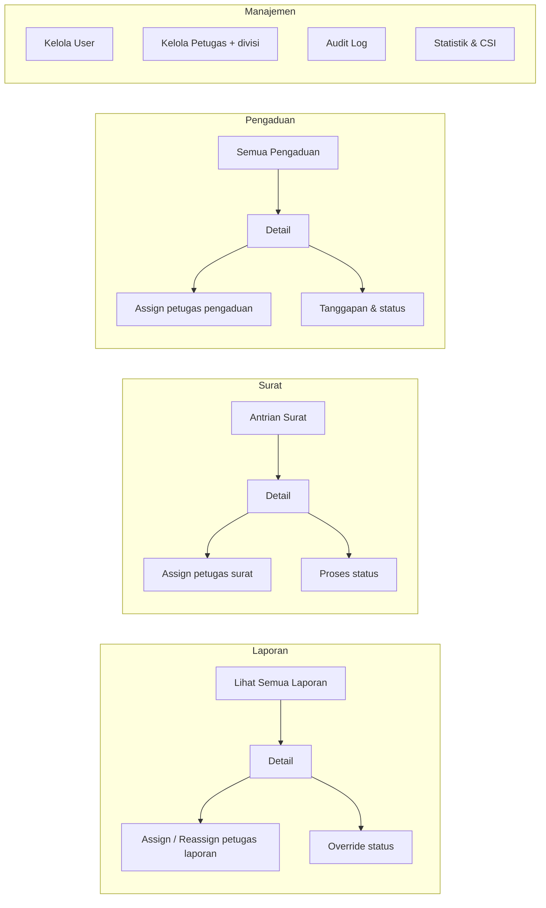

Setiap aksi admin penting (assign, override, hapus user, dll.) dicatat di **Audit Log** (`/api/audit-logs`).

---

## 10. Alur Petugas per Divisi

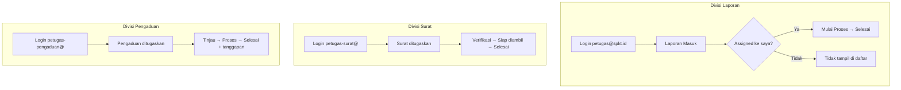

**Prinsip:** Petugas hanya melihat dan memproses tugas yang **sudah di-assign admin** ke akun mereka.

---

## 11. Diagram Database (ER Ringkas)

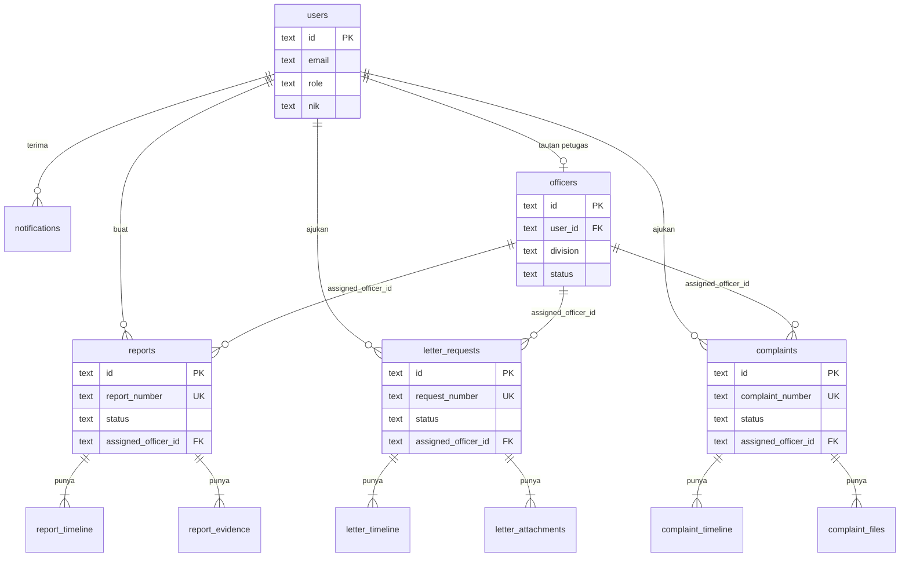

### Migrasi database (`ALTER TABLE`)

Saat ada fitur baru, `migrateSchema()` di `src/lib/db.ts` menambah kolom tanpa menghapus data lama — misalnya kolom `division` di `officers` dan kolom assign di `letter_requests` / `complaints`.

---

## 12. Peta API Lengkap

| Grup | Endpoint |
|------|----------|
| **Auth** | `/api/auth/login`, `logout`, `register`, `session`, `verify-2fa`, `forgot-password` |
| **Laporan** | `/api/reports`, `/api/reports/[id]` |
| **Surat** | `/api/letters`, `/api/letters/[id]`, `/api/letters/[id]/pdf` |
| **Pengaduan** | `/api/complaints`, `/api/complaints/[id]` |
| **Petugas** | `/api/officers`, `/api/officers/[id]` |
| **User** | `/api/users`, `/api/users/[id]`, `/api/users/me`, `me/password`, `me/preferences`, `me/export`, `me/totp` |
| **Notifikasi** | `/api/notifications`, `/api/notifications/[id]` |
| **Upload** | `/api/upload`, `/api/files/[name]` |
| **Info** | `/api/info/articles`, `/api/info/articles/[id]` |
| **Survey CSI** | `/api/survey/submit`, `check`, `csi/summary`, `dimensions`, `recent` |
| **Admin** | `/api/stats/admin`, `/api/audit-logs` |
| **Health** | `/api/health` |

---

## 13. Alur Notifikasi & CSI

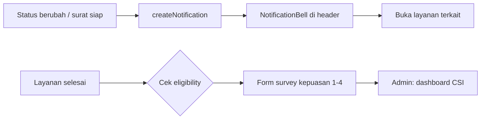

---

## 14. Alur File Upload

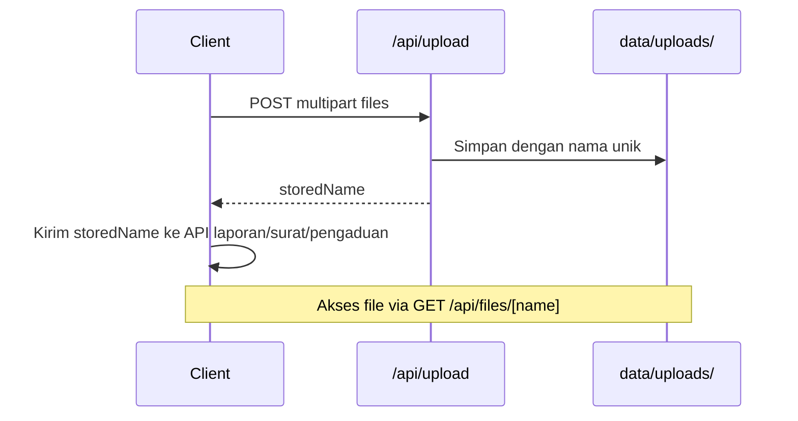

---

## 15. Ringkasan Alur End-to-End

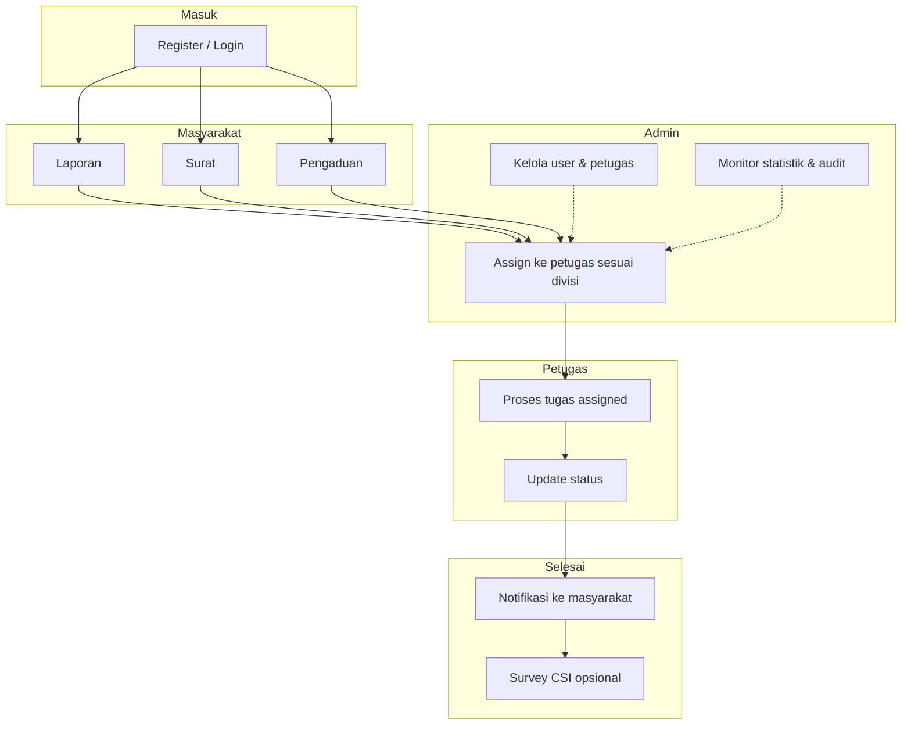

---

## 16. File Kode Penting

| Topik | File |
|-------|------|
| Routing & view per role | `src/components/DashboardApp.tsx` |
| Sidebar & menu | `src/components/Sidebar.tsx` |
| Divisi petugas | `src/lib/officerDivision.ts` |
| Status transitions | `src/lib/status-transitions.ts` |
| Business logic | `src/lib/services/spkt.ts` |
| Schema DB + seed | `src/lib/db.ts` |
| Nomor referensi | `src/lib/reference.ts` |
| Client API | `src/lib/spktApi.ts` |
| Auth session | `src/lib/auth-server.ts`, `src/contexts/AuthContext.tsx` |

---

*Terakhir diperbarui sesuai implementasi SPKT Digital — divisi petugas 3 bagian, assign oleh admin, audit log terpisah.*
